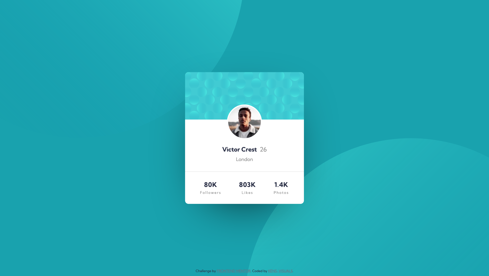

# Frontend Mentor - Profile Card Component Solution

This is a solution to the [Profile Card Component Challenge on Frontend Mentor](https://www.frontendmentor.io/challenges/profile-card-component-cfArpWshJ).

## Table of contents

- [Overview](#overview)
  - [The challenge](#the-challenge)
  - [Screenshot](#screenshot)
  - [Links](#links)
- [My process](#my-process)
  - [Built with](#built-with)
  - [Continued development](#continued-development)
  - [Useful resources](#useful-resources)
- [Author](#author)

## Overview

### The challenge

- Build out the project to the designs provided

### Screenshot

### Links

- Solution URL: [https://www.frontendmentor.io/solutions/simple-profile-card-component-built-with-scss-HwtVCsqjH](https://www.frontendmentor.io/solutions/simple-profile-card-component-built-with-scss-HwtVCsqjH)
- Live Site URL: [https://kens-visuals.github.io/profile-card-component/](https://kens-visuals.github.io/profile-card-component/)

## My process

### Built with

- Semantic HTML5 markup
- SCSS custom properties
- BEM naming convention
- CSS Flexbox
- Mobile-first workflow

### Continued development

I like this challange because it brought good memories of my early learning days when I was trying to implement some basic stuff with HTML/CSS.

### Useful resources

- [MDN](https://developer.mozilla.org/en-US/) - The one and only MDN. The coolest docs for HTML, CSS, JS and more.

## Author

- Frontend Mentor - [@kens-visuals](https://www.frontendmentor.io/profile/kens-visuals)
- Codewars - [@kens_visuals](https://www.codewars.com/users/kens_visuals)
- CodePen - [@kens-visuals](https://codepen.io/kens-visuals)
